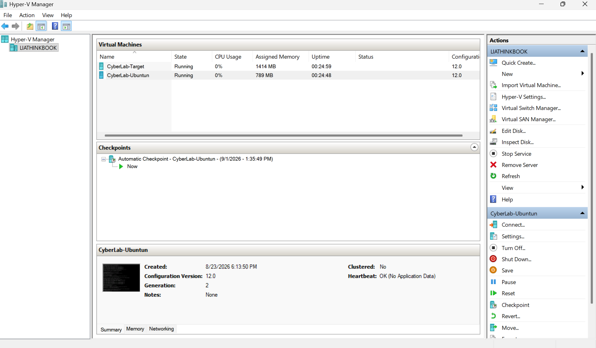
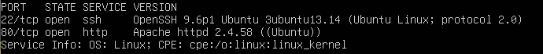
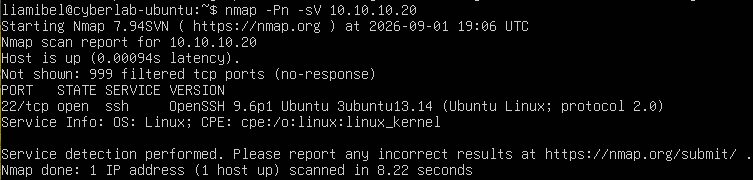
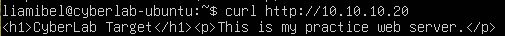

# Cybersecurity Homelab

A hands-on cybersecurity homelab built with Hyper-V and Ubuntu to practice networking, service enumeration, log analysis, and firewall configuration.

## Lab Overview

This lab uses two Ubuntu virtual machines running in Hyper-V:

- **CyberLab-Ubuntu** — analyst/scanning machine
- **CyberLab-Target** — target/server machine

The virtual machines communicate over an isolated internal network using static IP addresses.

## Technologies Used

- Hyper-V
- Ubuntu Server
- Nmap
- OpenSSH
- Apache2
- UFW
- curl
- Linux command line
- Netplan

## Network Setup

| Machine | Role | Internal IP |
|---|---|---|
| CyberLab-Ubuntu | Analyst / Scanner | 10.10.10.10 |
| CyberLab-Target | Target / Server | 10.10.10.20 |

## What I Built

- Created two Ubuntu virtual machines in Hyper-V
- Configured isolated virtual networking
- Assigned static IP addresses using Netplan
- Configured SSH access between virtual machines
- Installed and configured an Apache web server
- Created a custom webpage on the target server
- Used Nmap for port scanning and service/version detection
- Analyzed HTTP responses with curl
- Reviewed Apache access logs
- Monitored web requests in real time
- Configured UFW firewall rules
- Tested how firewall changes affected network visibility

## Screenshots

### Hyper-V Lab Environment

Two Ubuntu virtual machines running inside Hyper-V.

### Service Enumeration with Nmap

Nmap detected SSH on port 22 and Apache HTTP on port 80.

### Apache Access Log Analysis

Apache access logs showing HTTP requests from the analyst machine.

### Firewall Testing

After HTTP access was blocked with UFW, Nmap could still identify SSH while the remaining ports were filtered.

### Custom Web Server

The analyst machine successfully retrieved the custom webpage hosted on the target server.

## Skills Practiced

- Virtualization
- Linux administration
- TCP/IP networking
- Network segmentation
- Port scanning
- Service enumeration
- HTTP analysis
- Log analysis
- Firewall configuration
- Basic defensive security testing

## Next Steps

This lab will continue to be expanded with additional cybersecurity exercises, including more advanced monitoring, network traffic analysis, system hardening, and attack-and-defense scenarios.
